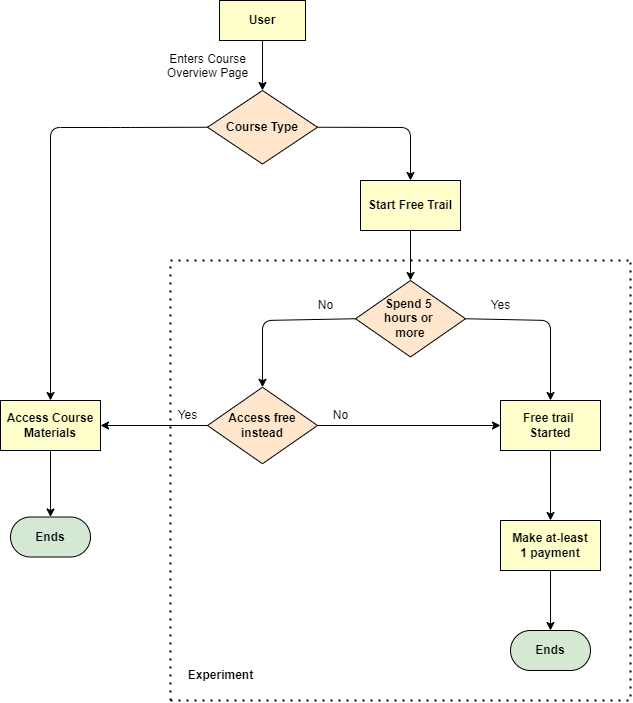

# AB-Testing-Udacity-Project
This project is the Udacity's A/B Testing final course project where a hypothetical experiment was conducted to test few metrics in the hypothetical online platform.

## Experiment Design

During the experiment, the Udacity courses have two options:

1. Start Free Trail 
2. Access Course Materials

If the student clicks start free trail, the student will be asked to enter their credit card details and they will be enrolled in the free course. After 14 days, they will be automatically charged unless they cancel first.

If the student clicks access course materials, they will be able to view the videos and take the quizzes for free, but they won't be able to receive coaching support and verified certificate, and they won't be able to upload their project to get the feedback.

For the experiment, udacity wants to test a change where if the student clicks - "Start free trail", they will be asked how much time they are willing to dedicate for the course. If the student selects 5 or more hours per week, a message would appear indicating that Udacity usually requires a greater time commitment. At this point the student would have the option to either join the free trail or access the course materials for free instead.

The hypothesis was that this might set clearer expectations for students upfront, thus reducing the number of frustrated students who left the free trial because they didn't have enough time—without significantly reducing the number of students to continue past the free trial and eventually complete the course. If this hypothesis held true, Udacity could improve the overall student experience and improve coaches' capacity to support students who are likely to complete the course.

The unit of diversion is a cookie, although if the student enrolls in the free trial, they are tracked by user-id from that point forward. The same user-id cannot enroll in the free trial twice. For users that do not enroll, their user-id is not tracked in the experiment, even if they were signed in when they visited the course overview page.

 

	

### Metric Choice

<table>
	<tr><th>Metric</th><th>Description</th></tr>
	<tr><td>Number of Cookies</td><td>That is, number of unique cookies to view course overview page</td></tr>
	<tr><td>Number of User-Ids</td><td>That is, number of users who enroll in the free trail</td></tr>
	<tr><td>Number of Clicks</td><td>That is, number of unique cookies to click the "Start free trail" button (which happens before the free trail screener is trigger)</td></tr>
	<tr><td>Click-through-Probability</td><td>That is, number of unique cookies to click the "Start free trail" button divided by the number of cookies to view the course overview page</td></tr>
	<tr><td>Gross Conversion</td><td>That is, number of user-ids to complete checkout and enroll in the free trail divided by number of cookies to click the "Start free trail" button.</td></tr>
	<tr><td>Retention</td><td>That is, number of user-ids to remain enrolled past the 14 day boundary (and thus make at least one payment) divided by number of user-ids to complete checkout</td></tr>
	<tr><td>Net Conversion</td><td>That is, number of user-ids to remain enrolled past the 14 day boundary (and thus make atleast 1 payment) divided by the nuber of unique cookies to click the "Start free trail" button</td></tr>
</table>

**Choosing Invariant Metrics**

1. Number of Cookies: Since the unit of diversion is Cookies, the number of cookies in both control and treatment groups will remain same.
2. Number of Clicks: Since the number of cookies that clicks the start free trail is before the "Free trail screener", the number of clicks in the two groups will remain approximately same. 
3. Click through Probability: This metric is the combination of the above two metric. So it will also remain the same.

**Choosing Evaluation Metrics**

1. Gross Conversion: Since the two different groups have same number of unique cookies, but the number of cookies checking out would be different as they will be shown Trigger.
2. Retention: Since the two different groups will have different behavior as the users in treatment groups would be more determined to complete the course and will remain enrolled. So the retention rate would be higher for the treatment group users.
3. Net Conversion: Since the two groups have different behavior after joining the free training, the number of users who will remain enrolled past 14 days will be higher in the treatment group.

### Measuring Standard deviation

For each of the metric you selected as an evaluation metric, make an analytical estimate of its standard deviation, given a sample size of 5000 cookies visting the course overview page. Enter each estimate in the appropriate box to 4 decimal places.

The following metric values were provided by Udacity

<table>
	<tr><th>Metric</th><th>Standar Deviation</th></tr>
	<tr><td>Number of Cookies</td><td>40,000</td></tr>
	<tr><td>Number of user-ids</td><td>660</td></tr>
	<tr><td>Number of clicks on 'Start Free Trial'</td><td>3200</td></tr>
	<tr><td>Click through Probability on 'Start Free Trial'</td><td>0.08</td></tr>
	<tr><td>Gross Conversion</td><td>0.2062</td></tr>
	<tr><td>Retention</td><td>0.53</td></tr>
	<tr><td>Net Conversion</td><td>0.1093</td></tr>
</table>

## Sizing

### Number of Samples vs. Power

### Duration vs. Exposure

## Experimental Analysis

### Sanity Checks

### Result Analysis

**Effective Test Size**

**Sign Test**

**Summary**

### Recommendation

